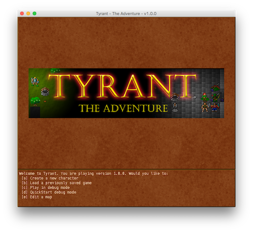
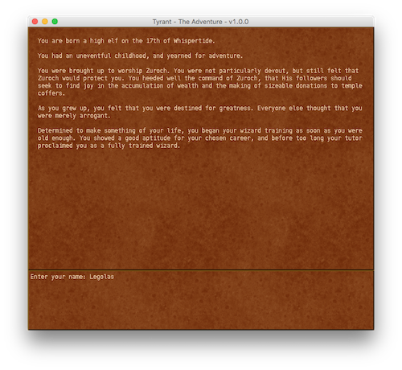
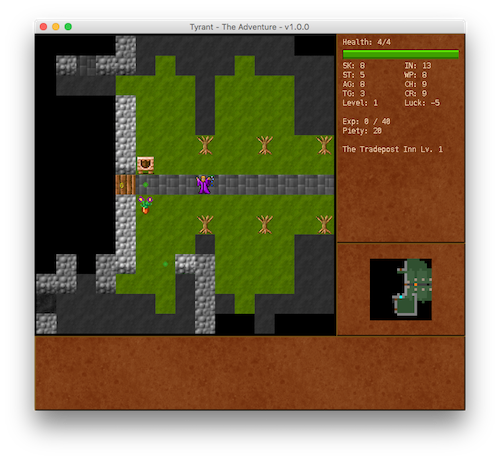

# Tyrant

A classic graphical roguelike game written in Java.

Tyrant was first written in 1997, and has been slowly extended ever since.

### Interesting Features

- Graphical roguelike with a custom 32x32 tileset
- A very flexible and configurable dynamic object model

### Screen Captures

### Apache NetBeans IDE 11.3 Setup

Click 'Open Project' in NetBeans IDE. Import the `tyrant` Project.  
Right click on Project, then click on 'Resolve Project Problems'.  
Select: `Some dependency artifacts are not in the local repository.` and click 'Resolve...' to begin downloading all necessary dependencies.  

Right click on the Project and click 'Run'.  
Select the `QuestApplication.java` file to begin the main program.  
